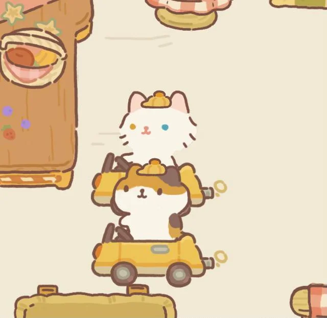
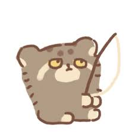
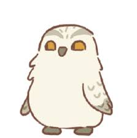
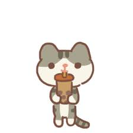
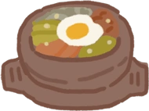
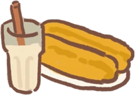

# My Top 5: Animal Restuarant 
Gabby's review for the Animal Restaurant app, a business simulation idle mobile phone game.

## My Favorite Characters
There are several characters that appear in Animal Restaurant. Some are workers, while others are customers.

### Top Five Customers:
Gnome

The gnome is rarely seen and can only be attracted by cooking Fried Rice, Takoyaki, Chocolate Cake, Salmon Sushi, or Kimbap. I particularly like this character due to its whimsical design. 

Granny Wolf

The Granny Wolf is from the town and commonly orders Roast Shrimp, Fried Shrimp Sushi, Espresso, or Steamed Clams. The allusion to Red Riding Hood and red scarf design really pulls together the character. 

White Shiba

The White Shiba is a picky customer from the village area. It commonly orders Mushroom Pasta, Kimbap, Shaved Ice, or Scrambled Eggs & Tomatoes. My personal favorite aspect of this customer is the tongue sticking out detail that gives it its particularly cute aura. 

White-Collar Fox

The White-Color Fox is a dapper, yet impatient customer from the bustling city. Its description directly states that it seems to "do business with some dangerous humans". The fox commonly orders Kebabs, Salmon Sushi, Whiskey, Wrap, Roast Shrimp, or Sweet and Sour Pork. The fashionable briefcase and suit brings together the character design of this customer. 

Glamarous Lady

Glamarous Lady fashions a leapord print dress with a red scarf and handbag. As a very rare customer, she has a special ability of eating six different dishes and speeds up cooking by 100%. The Glamarous Lady commonly orders Fried Tofu, Sweet Dumplings, Rice Pudding, Pork on Rice, Cold Watermelon, or Sycee Dumplings.

### Top Five Staff:
Chef Gumi

Chef Gumi! The head chef and the key player of Animal Restaurant. You will depend a lot on him during crazy rush hours. Overtime, you will grow quite fond of Gumi's mysteries and indifference.

Delivery Boy Tate and Delivery Girl Kat

Deliver Boy Tate and Deliver Girl Kat run the takeout center of your restaurant. The twin siblings are caring for one another and quite adorable!

Fisherman Rabbit Ding

Fisherman Rabbit Ding will dig up bait for you everyday in the Fishing Pond. This bait can be used to fish up trash, fish, or other belongings admist the pond. 

Messenger Hedwig

Messenger Hedwig can carry flowers, seeds, and watering cans and in return bring back letters or rewards from neighboring restaurants.

Temp Worker Yolky

The youngest of the staff, Temp Worker Yolky is a hardworking employee for the Buffet who always manages to have boba in its paws.

### (Bonus!) Top Five Recipes:
Shaved Ice

Custard Bun

Bibimbap

Fries

Soy Milk & Cruller

## Social Media
To recieve more Animal Restaurant content...
Instagram: [Animal Restaurant (@animal_restaurant)](https://www.instagram.com/animal_restaurant/?hl=en)
Twitter: [Animal Restaurant (@AML_Restaurant)](https://twitter.com/AML_Restaurant?ref_src=twsrc%5Egoogle%7Ctwcamp%5Eserp%7Ctwgr%5Eauthor)

